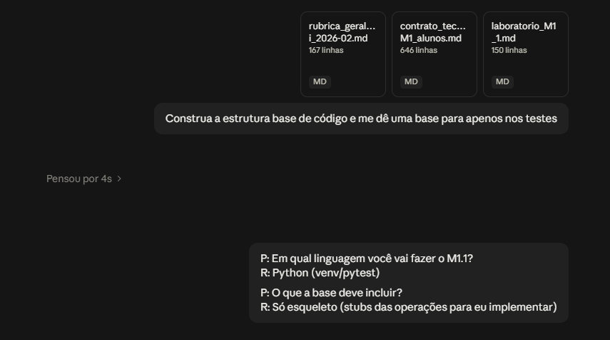

# Declaração de uso de Inteligência Artificial generativa

**Ferramenta utilizada:**`Claude (Anthropic)`
**Finalidade**: geracao da estrutura do projeto, testes e correcao de escrita.
**partes afetadas:** `src/pdi_lab/main.py`, `tests/test_lab.py`, `testes/EXAMPLES.md`, `README.md`,`REPORT.md`.

Prompt:

Quando não houver link compartilhável, anexe um registro equivalente que
permita compreender as orientações recebidas e como foram utilizadas.
