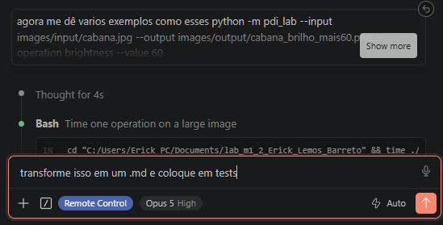
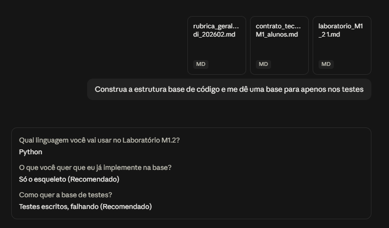

# Declaracao de uso de Inteligência Artificial generativa

Declaro que utilizei ferramenta de IA generativa na elaboracao deste
laboratório.

**Ferramenta utilizada:** Claude (Claude Code / modelo Opus 5), da Anthropic.
**Finalidade:** Estruturacao do projeto e construcao de testes automatizados.
**Partes alteradas:**
`Projeto em si, estrutura`;
`tests/test_operacoes.py`;
`images/input/sintetica.png`(imagem gerada para os testes manuais);
`exemplos_cli`geracao de md com testes de copia e cola para facilitar testes;

**Modificacoes realizadas:** Alguns pequenos ajustes simples de formatacao e organizacao das linhas geradas.
**Link da conversa ou registro equivalente:** 

Assumo a responsabilidade por compreender, testar e validar todo o conteúdo
entregue.
